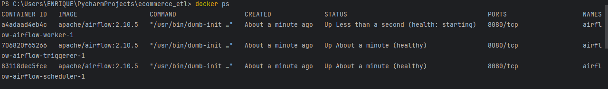
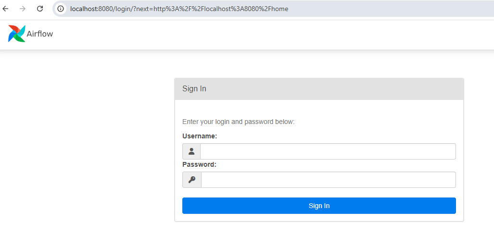
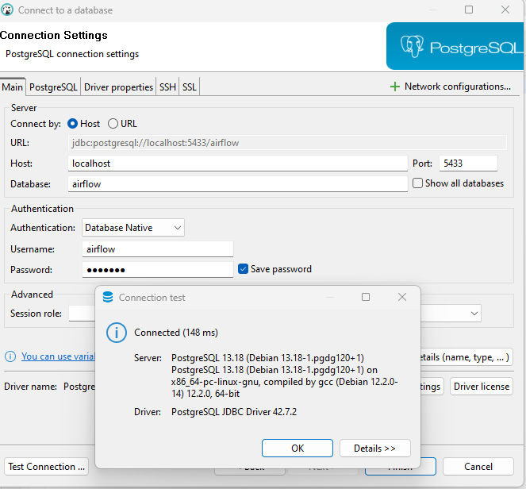

# ECOMMERCE_ETL

The follow document describes how generate a ETL process when we are simulated CSV files like files in s3 bucket.

## Prerequisites
Tools needed to work the proccess:
- Python v3.11 (language code)
- Pycharm (Python environment development)
- Dbeaver (open source database client )
- Dockerhub ( imnage central repository of tools)
- PostgreSQL v15.10 (database)
- Airflow v (orchestator)

## Installation
- Install dockerhub following the next link https://docs.docker.com/docker-hub/quickstart/
- Install pycharm following the next link https://www.jetbrains.com/help/pycharm/installation-guide.html
- Install dbeaver following the next link https://dbeaver.io/download/

After the installation of tools run the follow command in pycharm environment `bash ./process.sh`.  
When the script finished , run the follow command to check if the components are ready `docker ps`  

Example of docker ps output

After that we need to open the web and type `localhost:8080`  
User : airflow , password: airflow

Verified the postgres connection since dbeaver and set the following values:
#### user : airflow 
#### password : airflow 
#### database : airflow 
#### port : 5433 

