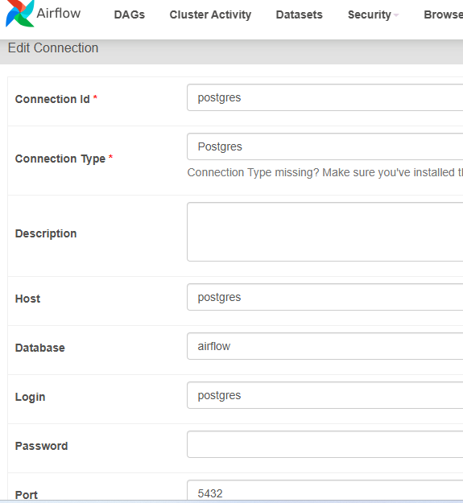
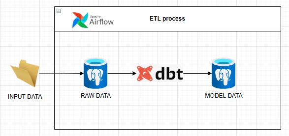
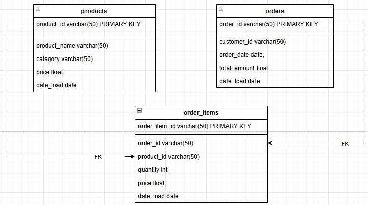
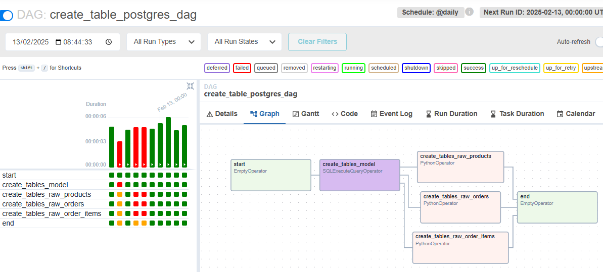
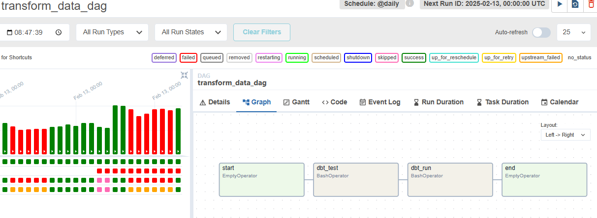

# ECOMMERCE_ETL

The follow document describes how generate a ETL process when we are simulated CSV files like files in s3 bucket.

## Prerequisites
Tools needed to work the proccess:
- Python v3.11 (language code)
- Pycharm (Python environment development)
- Dbeaver (open source database client )
- Dockerhub ( imnage central repository of tools)
- PostgreSQL v15.10 (database)
- Airflow (orchestator)

## Installation
- Install dockerhub following the next link https://docs.docker.com/docker-hub/quickstart/
- Install pycharm following the next link https://www.jetbrains.com/help/pycharm/installation-guide.html
- Install dbeaver following the next link https://dbeaver.io/download/

After the installation of tools run the follow command in pycharm environment `./process.sh`.  
When the script finished , run the follow command to check if the components are ready `docker ps`  

Example of docker ps output

After that we need to open the web and type `localhost:8080`  
User : airflow , password: airflow

Add the postgres configuration like below image 

Verified the postgres connection since dbeaver and set the following values:
#### user : airflow 
#### password : airflow 
#### database : airflow 
#### port : 5433 

## Execution

The solution contains the follow components:
- Airflow : Schedule task to extract data from csv and load in postgres
- DBT : Modeling and tranform the data
- Postgres : Database that store the data for analysis
 

Inside postgres there the follow relation
 

Next step is run the DAG named `create_table_postgres_dag` to read csv data and populate the raw tables
 

The next step is run the DAG named `transform_data_dag` that contains dbt test and data modeling to populate model tables from raw tables
 

## Questions 

- What are the top-selling products by revenue and quantity?

`select b.product_name  , (a.quantity * a.price) total
from model.order_items a
inner join model.products b
on a.product_id = b.product_id
order by 2 desc; `

- What is the average order value?

`select AVG(total_amount)
from model.orders;`

- How does product performance vary by category?

`select a.category, (sum(a.price)/(select sum(price) from model.products )) performance
from model.products a
group by category ;`

- What are the trends in revenue and order volume over time?

`select c.product_name ,a.order_date, sum(b.quantity * b.price) volume, sum(b.quantity * b.price - c.price) revenue
from model.orders a
inner join model.order_items b
on a.order_id  = b.order_id
inner join model.products c
on b.product_id = c.product_id
group by c.product_name,a.order_date
order by 4 desc`
